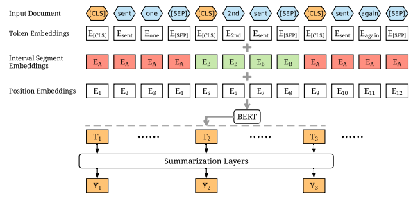

## 💡프로젝트 소개

#### 1️⃣ 주제 : 텍스트 추출 요약<br>
#### 2️⃣ 설명 : [Fine-tune BERT for Extractive Summarization](https://arxiv.org/pdf/1903.10318v2.pdf)을 기반으로 추출 요약 모델 구현<br> 
#### 3️⃣ 모델 : Hugging Face [klue/bert-base](https://huggingface.co/klue/bert-base) 모델 사용하여 진행<br><br>

### 해당 프로젝트에 관한 자세한 사항은 블로그에 정리해 놓았다.
- [KlueBERT를 활용한 뉴스 세 줄 요약 서비스_1(ft.논문 소개)](https://velog.io/@jx7789/KlueBERT%EB%A5%BC-%ED%99%9C%EC%9A%A9%ED%95%9C-%EB%89%B4%EC%8A%A4-%EC%84%B8-%EC%A4%84-%EC%9A%94%EC%95%BD-%EC%84%9C%EB%B9%84%EC%8A%A41ft.%EB%85%BC%EB%AC%B8%EC%86%8C%EA%B0%9C)
- [KlueBERT를 활용한 뉴스 세 줄 요약 서비스_2(ft.데이터)](https://velog.io/@jx7789/KlueBERT%EB%A5%BC-%ED%99%9C%EC%9A%A9%ED%95%9C-%EB%89%B4%EC%8A%A4-%EC%84%B8-%EC%A4%84-%EC%9A%94%EC%95%BD-%EC%84%9C%EB%B9%84%EC%8A%A42ft.%EB%8D%B0%EC%9D%B4%ED%84%B0)
- [KlueBERT를 활용한 뉴스 세 줄 요약 서비스_3(ft.모델)](https://velog.io/@jx7789/KlueBERT%EB%A5%BC-%ED%99%9C%EC%9A%A9%ED%95%9C-%EB%89%B4%EC%8A%A4-%EC%84%B8-%EC%A4%84-%EC%9A%94%EC%95%BD-%EC%84%9C%EB%B9%84%EC%8A%A43ft.%EB%AA%A8%EB%8D%B8)
- [KlueBERT를 활용한 뉴스 세 줄 요약 서비스_4(ft.평가)](https://velog.io/@jx7789/KlueBERT%EB%A5%BC-%ED%99%9C%EC%9A%A9%ED%95%9C-%EB%89%B4%EC%8A%A4-%EC%84%B8-%EC%A4%84-%EC%9A%94%EC%95%BD-%EC%84%9C%EB%B9%84%EC%8A%A44ft.%ED%8F%89%EA%B0%80)

## 논문 소개
- BERT를 기반으로 Simple Classifier, Inter-sentence Transformer, Recurrent Neural Network 세가지 종류의 summarization-specific layers를 추가하여 추출 요약 실험 진행
<br>


### 부연설명
- Embedding Multiple Sentences
  - 문장의 시작 : [CLS], 문장의 끝 : [SEP] 을 삽입하여 기존 [SEP]만 사용하여 문장들을 구분하던 BERT모델을 개선했다.
  - 여러개의 [CLS] 토큰을 사용하여 각 문장들의 feature를 [CLS] 토큰에 저장한다.
- Interval segment Embedding
  - 여러 문장이 포함된 문장에서 문서를 구분하기 위해서 사용됨
  - 요약 문서의 특성 상 두개 이상의 문장이 포함되므로 기본의 방식과는 다르게 문장1~4를 A와 B를 번갈아가며 구분
- Summarization Layers
  - BERT로부터 문장 vector에 대한 정보를 얻은 다음에 추출 요약을 위하여 문서 단위의 feature를 잡기 위해 그 결괏값 위에 summarization-specific layers를 쌓는다. 
  - Simple Classifier
    - 기존 BERT와 같이 Linear layer 및 Sigmoid function
  - Inter-sentence Transformer
    - 문장 representations을 위하여 Transformer layer을 사용하며 마지막 단계에서는 Transformer layer로부터 나온 문장 vector를 sigmoid classifier 넣는다. 그리고 Layer가 2개일 때의 성능이 제일 좋았다.
  - Recurrent Neural Network
    - Transformer와 RNN결합시 성능이 좋았으며 BERT output을 LSTM layer로 넘겨준다. 마지막 단계에서는 sigmoid classifier를 사용한다.


---
## 1. train

```
logdirlocation = 'LOG/KLUE'
os.makedirs(logdirlocation, exist_ok=True)

!python SRC/train.py \
  -mode train \
  -encoder transformer \
  -dropout 0.1 \
  -bert_data_path data/bert_data/train/korean \
  -model_path MODEL/KLUE/bert_transformer_result \
  -lr 2e-3 \
  -visible_gpus 0 \
  -gpu_ranks 0 \
  -world_size 1 \
  -report_every 1000\
  -save_checkpoint_steps 10000 \
  -batch_size 1000 \
  -decay_method noam \
  -train_steps 50000 \
  -accum_count 2 \
  -log_file LOG/KLUE/bert_transformer_result.txt \
  -use_interval true \
  -warmup_steps 10000 \
  -ff_size 2048 \
  -inter_layers 2 \
  -heads 8
     
```

## 2. Test
```
!python SRC/train.py \
  -mode inference \
  -visible_gpus -1 \
  -gpu_ranks -1 \
  -world_size 0 \
  -log_file LOG/KLUE/bert_transformer_result.txt \
  -test_from MODEL/KLUE/bert_transformer_result/model_step_50000.pt \
  -input_text raw_data/valid/valid_0.txt
```

## 3. [Rouge](https://github.com/jx-dohwan/kluebert_Extract_summary/blob/main/rouge_evaluation.ipynb)
---


